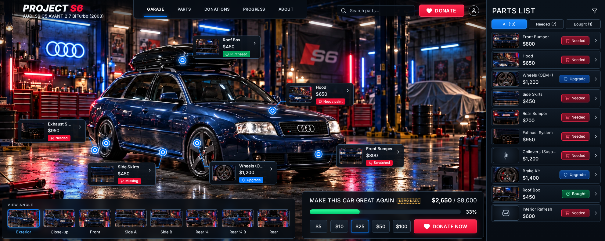

# PROJECT S6: restoration crowdfunding garage

A neon-garage dashboard for crowdfunding an Audi S6 C5 Avant restoration. Visitors switch camera angles, click blue hotspots on the car's parts, and contribute through Stripe Checkout. Campaign content and payment records live in Supabase.

- **Frontend:** React 19 + Vite 8 (JavaScript/JSX), React Router, plain CSS with design tokens, Lucide icons
- **Payments API:** Node.js + Express 5 (`server/`): Stripe Checkout sessions, signed webhooks, scoped status lookup
- **Data:** Supabase Postgres with RLS, Auth for the owner, Storage for update photos (`supabase/migrations/`)



## Quick start (demo mode, no credentials)

Requires Node 20+ (tested on Node 26.5).

```bash
npm install
npm run dev            # Vite on :5173 + API on :3001 (Vite proxies /api)
# or only the frontend:
npm run dev:web
```

Open http://localhost:5173. With no `.env`, the site runs in **demo mode**:

- Parts, the $2,650 / $8,000 funding sample and the progress entries come from `src/data/demoProject.js`. Each one carries a **Demo data** label.
- The donation dialog works, but submitting only explains that **no payment was taken**. Totals never change.
- No supporters are invented. The donations page shows an empty state.

## Commands

| Command | What it does |
| --- | --- |
| `npm run dev` | Frontend and API together (`concurrently`) |
| `npm run dev:web` / `npm run dev:api` | Run either one alone |
| `npm test` | Vitest: unit, UI (jsdom), RLS (PGlite) and payment-API tests |
| `npm run build` | Production frontend build to `dist/` |
| `npm run preview` | Serve the built frontend |
| `npm run start:api` | Run the API without watch mode |
| `npm run screenshots` | Playwright screenshots at 1983×793, 1440×900, 1024×768 and 390×844 into `docs/screenshots/` (needs `npm run dev:web` running) |
| `python3 scripts/make-derivatives.py` | Regenerate WebP stage images, thumbnails and part crops |

## Environment

Copy the examples. They contain no secrets.

```bash
cp .env.example .env                 # browser-safe values only
cp server/.env.example server/.env   # server secrets
```

**Frontend (`.env`).** Everything here ships to the browser.

| Variable | |
| --- | --- |
| `VITE_SUPABASE_URL` | `https://<ref>.supabase.co` |
| `VITE_SUPABASE_PUBLISHABLE_KEY` | Publishable key (`sb_publishable_…`). The legacy anon key also works. |
| `VITE_DEMO_MODE` | `true` = labelled fixtures; `false` = live Supabase data |
| `VITE_PROJECT_SLUG` | `projects.slug` to show (default `project-s6`) |

**Server (`server/.env`).** Never prefix these with `VITE_`.

| Variable | |
| --- | --- |
| `SUPABASE_URL` | Same project URL |
| `SUPABASE_SECRET_KEY` | Secret key (`sb_secret_…`). `SUPABASE_SERVICE_ROLE_KEY` is accepted as a legacy fallback. |
| `STRIPE_SECRET_KEY` | `sk_test_…` for development |
| `STRIPE_WEBHOOK_SECRET` | `whsec_…` from `stripe listen` or the Dashboard endpoint |
| `APP_ORIGIN` | Public site origin. Used for return URLs and the Origin check. |
| `PORT` | API port (default 3001) |
| `DONATION_MIN_CENTS` / `DONATION_MAX_CENTS` | Server-side limits (default 100 / 1,000,000) |
| `TRUST_PROXY` | Set to `1` behind one reverse proxy, so rate limiting sees real IPs |
| `SERVE_STATIC` | `true` makes the API also serve `dist/`, for a single-service deploy |

**Live mode without credentials** (`VITE_DEMO_MODE=false` but no Supabase) shows a clear "live data unavailable" banner. Totals read "unavailable" and donating is disabled. The app never falls back to demo money.

## Supabase setup

1. Create a project. Then either:
   - **CLI:** run `supabase link --project-ref <ref>`, then `supabase db push` (applies `supabase/migrations/*`). Then load the campaign content by running `supabase/seed.sql` in the SQL editor, or `supabase db push --include-seed`.
   - **Local stack:** run `supabase init` (keep the existing `supabase/` files), then `supabase start` and `supabase db reset` (migrations + seed).
   - **Dashboard only:** paste each migration file in order into the SQL editor, then `seed.sql`.
2. Put the URL and keys into `.env` and `server/.env`, and set `VITE_DEMO_MODE=false`.

What the migrations create:

| Object | Access |
| --- | --- |
| `projects`, `parts`, `restoration_updates` | Public read (published only). Owners can write. |
| `project_admins` | Read your own membership only. No client writes. |
| `donations`, `stripe_events` | **Private.** No grants to anon/authenticated. Only the server (secret key) touches them. |
| `get_campaign_summary(slug)` | Public safe aggregate: goal, confirmed total minus refunds, count |
| `get_public_contributions(slug)` | Public: consented display name, net amount, part name, date. No emails or Stripe ids. |
| `create_pending_donation`, `attach_checkout_session`, `process_stripe_event`, `get_donation_status` | `service_role` only. Each runs in a single transaction. |
| Storage bucket `project-media` | Public read. Owners write only under `<project_id>/…`. |

Supabase grants broad defaults on new tables, so every table first revokes all access and then grants only what's needed. Owner writes require a row in `project_admins`; being signed in isn't enough.

### Owner provisioning (trusted step)

1. Create the owner user (Dashboard → Authentication → Add user, with email + password).
2. In the SQL editor (it runs as a privileged role):

```sql
insert into public.project_admins (project_id, user_id)
select p.id, u.id from public.projects p, auth.users u
where p.slug = 'project-s6' and u.email = 'owner@example.com';
```

3. Sign in with the account icon (`/admin`). There you can edit campaign copy and the goal, edit parts, set purchase status, add parts, and post or unpublish updates with photos. Mark parts **Bought** only after buying them. Donations never change part status.

## Stripe (test mode)

Donations use hosted **Stripe Checkout**, so card details never touch this site.

1. Put `sk_test_…` in `server/.env` as `STRIPE_SECRET_KEY`.
2. Forward webhooks locally with the [Stripe CLI](https://docs.stripe.com/stripe-cli):

   ```bash
   stripe listen --forward-to localhost:3001/api/stripe/webhook \
     --events checkout.session.completed,checkout.session.async_payment_succeeded,checkout.session.async_payment_failed,checkout.session.expired,charge.refunded
   ```

   Copy the printed `whsec_…` into `STRIPE_WEBHOOK_SECRET` and restart the API.
3. Run `npm run dev`, click **Donate**, and pay with test card `4242 4242 4242 4242`. The success page shows "Confirming…" until the webhook marks the donation paid, then it thanks the donor.
4. To test a refund, refund the payment in the Dashboard. `charge.refunded` lowers the total.

`stripe trigger checkout.session.completed` sends events without our `donation_id` metadata. The API acknowledges and ignores those, by design.

**Production:** add an endpoint `https://<api-host>/api/stripe/webhook` in the Stripe Dashboard with the five events above, and use its signing secret.

How the flow stays safe:

- `POST /api/donations/checkout` validates the project, part and amount (integer cents, within limits), plus the display name and an `attemptId` UUID. It creates a *pending* row, then creates the Checkout Session with idempotency key `donation-checkout-<attemptId>`, so double-clicks and retries never create two donations. The submit button is disabled while the request runs.
- `POST /api/stripe/webhook` verifies the signature against the **raw body**. It records each event id once (`stripe_events` primary key), inside the same transaction as the donation update. Status only moves forward: pending → processing → paid/failed, and pending → expired. A paid donation is never downgraded by a late `expired`. Async payment methods are handled. Refunds keep the cumulative maximum, so their order doesn't matter. An amount or currency mismatch is flagged `needs_review` and not counted. If the donation row isn't visible yet, the transaction rolls back and the API returns 500, so Stripe retries.
- `GET /api/donations/status?session_id=cs_…` returns only status, amount, currency and part name, looked up by the unguessable Checkout Session id. The success URL alone never marks anything paid.
- Other safeguards: helmet, a 10 KB JSON limit, an Origin check, per-IP rate limits, and redacted logs (emails, keys, Stripe ids).

## Production hosting

- **Frontend:** static `dist/` on any static host, with an SPA fallback to `index.html`.
- **API:** a real Node server is required (Render, Fly, Railway, a VM, etc.). Vite's `/api` proxy only exists in development. Either serve the frontend and API from the same origin (reverse proxy `/api` → API), or run the API with `SERVE_STATIC=true` so it serves `dist/` itself. Set `APP_ORIGIN` to the public site URL and `TRUST_PROXY=1` behind a proxy.
- Use live Stripe keys only on the deployed server. Nothing here was deployed or charged during development.

## SEO

All SEO copy lives in **`src/seo/config.js`**: titles, descriptions, H1s, breadcrumbs and sitemap priorities. Three places read it:

| Where | What it does |
| --- | --- |
| Build (`vite/seoPlugin.js`) | Writes `dist/<route>/index.html` for every route, with that route's head already filled in: title, description, robots, canonical, Open Graph, Twitter card and JSON-LD. Also writes `404.html`, `robots.txt` and `sitemap.xml`. Crawlers and link-preview bots get correct tags without running JavaScript. |
| Browser (`src/seo/useSeo.js`) | Updates the same tags in place on client-side navigation, so there are no duplicates. |
| API static mode (`SERVE_STATIC=true`) | Serves each route its own HTML, and returns a **real 404** with `404.html` for unknown paths. |

Behaviour per page:

- **Public pages** (`/`, `/parts`, `/donations`, `/progress`, `/about`): `index, follow`. They have a canonical URL, OG/Twitter tags with a 1200×630 `og-image.jpg`, and JSON-LD (`WebSite`, `Car`, `WebPage`, plus `BreadcrumbList` on sub-pages). Unit tests keep titles ≤ 60 characters and descriptions ≤ 160.
- **Private pages** (`/admin`, `/donation/*`) and the 404 page: `noindex, nofollow`, with no canonical tag and no JSON-LD.
- **robots.txt:** these private pages are deliberately *not* disallowed, so crawlers can fetch them and see the `noindex`. Only `/api/` is blocked.
- **`VITE_NOINDEX=true`** (staging and previews): every page becomes noindex, and robots.txt disallows everything.

Set **`VITE_SITE_URL`** (for example `https://projects6.com`) for production builds. Without it, the absolute-only tags are left out and the build prints a warning. Affected: canonical, `og:url`, `og:image`, JSON-LD and the sitemap.

Other assets in `public/`:
- `og-image.jpg`
- `favicon.ico`, `favicon.svg`, `apple-touch-icon.png`
- `icon-192.png`, `icon-512.png`, a maskable icon
- `manifest.webmanifest`

Regenerate the images with `node scripts/make-brand-assets.js`.

**Static hosts:** the per-route `index.html` files work with pretty URLs on Netlify and Cloudflare Pages. On Vercel, set `"cleanUrls": true`. Point the host's 404 page at `404.html`.

## Google Tag Manager & analytics

Set `VITE_GTM_ID=GTM-XXXXXXX` and rebuild. The plugin injects the following, in the order Google requires:

1. **Consent Mode v2 defaults**, before GTM loads: `analytics_storage`, `ad_storage`, `ad_user_data` and `ad_personalization` all `denied`. A visitor's earlier choice is restored from `localStorage`.
2. The **GTM container** in `<head>`.
3. The **`<noscript>` iframe** right after `<body>`. Turn it off with `VITE_GTM_NOSCRIPT=false`.

With GTM set, a small banner asks visitors to allow analytics. "Allow" grants only `analytics_storage`; ad signals stay denied. Visitors can reopen the choice from About → Cookie settings. Without an ID, no GTM loads and no banner shows. GTM loads in production builds only, unless `VITE_GTM_IN_DEV=true`.

**dataLayer events** (no names, emails or Stripe ids are ever pushed):

| Event | When | Parameters |
| --- | --- | --- |
| `virtual_page_view` | Every route change (SPA) | `page_path`, `page_title`, `page_location` (query strings removed) |
| `select_item` | Part chosen from a dot, card or list | `selection_source`, `ecommerce.items[]` |
| `select_angle` | Camera view changed | `angle_id` |
| `search` | Search settles (1.2 s debounce) | `search_term` |
| `donate_dialog_open` | Donation dialog opened | `part_id` |
| `begin_checkout` | Live checkout started | `ecommerce` (currency, value, items) |
| `purchase` | **Only after the server confirms payment**; once per donation | `ecommerce.transaction_id` (SHA-256 of the session id), value, items |
| `donation_cancel` | Return from a cancelled checkout | `part_id` |
| `donation_demo_preview` | Demo-mode submit (kept out of ecommerce reports) | value, currency |
| `consent_update` | Visitor made a consent choice | `analytics_consent` |

Ecommerce events are preceded by `{ ecommerce: null }`, as Google recommends.

**GTM container setup:**
1. Add a **GA4 Configuration/Google tag** that fires on Initialization, with consent checks enabled.
2. Add a **GA4 Event** tag named `page_view`, triggered by the Custom Event `virtual_page_view`. Map `page_location` and `page_title`. In GA4, turn off Enhanced Measurement → "Page changes based on browser history events", so pages aren't counted twice.
3. Add **GA4 Event** tags for `select_item`, `begin_checkout` and `purchase`, with "Send Ecommerce data: Data Layer". Add custom events as needed.

## Motion

- **Parallax:** the garage photo drifts a few pixels away from the pointer (`useParallax`). The photo and its hotspots sit in one transformed layer, so dots stay locked to the bodywork.
- **View change:** the new photo glides in from the direction you moved in the strip (about 0.5 s). The old one eases out. Then the dots pop in, staggered, followed by the cards.
- **No flicker:** hover only restyles cards; it never changes which cards exist or where they sit. Clicking a featured part changes nothing in the layout. Opening the details drawer hides the cards under it instead of re-laying them out. Each element's entry animation is fixed when it mounts, so re-renders can't restart it.
- **Reduced motion and touch:** parallax is off on touch devices and with `prefers-reduced-motion`; that setting also disables the other animations.

## Hotspots & calibration

Each camera view in `src/data/views.js` has its own hotspot map, in **normalized source-image coordinates** (0–1 of the 1672×941 original). `src/lib/projection.js` maps them to the screen using the same fit and position as the ``:

- **Wide stages:** `cover`, cropping only ceiling and floor.
- **Taller stages:** `contain`, with a blurred backdrop.
- **Phones:** `focus`, zoomed to the car's bounding box.

Anchors that land outside the visible image, or under panels, are hidden, never clamped. Callout cards are laid out by `src/lib/calloutLayout.js`, which avoids panels, other cards and other dots, and drops cards when space runs out.

**Calibration (dev only):** run `npm run dev` and open `http://localhost:5173/?calibrate=1`.

1. Clicking the photo logs normalized `x, y` and shows a readout.
2. To move an anchor, choose a part in the panel and click its new spot.
3. **Copy view config** copies the edited hotspot JSON (also logged to the console). Paste the values into `views.js`.

The panel is gated by `import.meta.env.DEV`, so it never appears in production builds.

## Architecture

```
src/
  components/  AppHeader, GarageStage, CarViewer (renderer boundary), ImageCarViewer,
               HotspotLayer, HotspotButton, PartCallout, PartsSidebar, PartDetailsDrawer,
               AngleSelector, FundingPanel, DonationDialog, Modal, CalibrationPanel
  pages/       Garage, Parts, Donations, Progress, About, Admin (lazy), DonationReturn, NotFound
  data/        views.js (camera + hotspot config), demoProject.js (labelled fixtures), assetManifest.js
  hooks/       useProjectData (demo/live data provider), useGarageState (view, selection, search,
               donation draft), useImageProjection, useMediaQuery, useShell
  lib/         projection.js, calloutLayout.js, money.js, parts.js, donations.js, liveData.js, supabase.js
  styles/      tokens.css, global.css, garage.css, pages.css
server/        app.js (routes), stripeEvents.js, db.js (Supabase RPC adapter), validation.js, logger.js
supabase/      migrations/ (schema, RLS, payment functions, storage), seed.sql
tests/         see "Tests"
```

`<CarViewer mode="image" viewId selectedPartId onPartSelect … />` is the only contact point between the shell and the car renderer. A future Three.js renderer can implement the same props with its own 3D anchor metadata. Donations, the catalogue and part ids don't depend on pixel positions.

## Tests

`npm test` runs 124 tests:

| File | Covers |
| --- | --- |
| `projection.test.js` | Contain/cover/focus math, letterboxing, cropping, object-position, resize stability, hidden anchors |
| `calloutLayout.test.js` | No overlap with panels or other cards, layout stable on selection (no flicker), card budget, leader endpoints |
| `views.test.js` | Every view's files exist, missing angles unavailable, coordinates normalized, front ≠ rear dots, no coilovers/interior dot |
| `parts.test.js`, `money.test.js` | Counts from data, search, preset/custom amount parsing and limits |
| `garage.ui.test.jsx` | Angle switch swaps image and dots together, dot ↔ row sync, off-camera and unphotographed parts, search hides dots, demo donation, all routes |
| `rls.test.js` | **Real migrations in PGlite** with Supabase-like roles and default grants: anonymous / non-owner / owner reads and writes, private donations, safe aggregates, storage paths |
| `server.checkout.test.js` | Validation, idempotency, origin check, Stripe failure, 503 without config, pending status |
| `seo.test.js`, `seo.build.test.js` | Title/description limits, noindex rules, escaping, sitemap/robots; a **real Vite build** checked page by page, Consent-before-GTM order, real 404 from the static server |
| `analytics.ui.test.jsx` | Head updates on navigation, page views, funnel events, no PII or session ids in the dataLayer, purchase deduplication, consent banner |
| `server.webhook.test.js` | Real Stripe signature verification, invalid/forged signatures, duplicates, async success/failure, out-of-order delivery, expiry, refunds, amount mismatch, retry on DB failure |

The webhook tests sign payloads with the real `stripe` library, and the payment SQL functions run in PGlite. Only `checkout.sessions.create` is mocked, so no network calls are made. **Live Stripe and hosted Supabase were not exercised** (no credentials were available). See `docs/REPORT.md`.

## Assets

See [ASSETS.md](ASSETS.md) for the original → local mapping, derivatives and gaps. In short: the six requested angles plus two extra rear three-quarter photos are used. There are **no** interior, engine, top-view or verified opposite-side photos, so those slots aren't selectable and nothing was fabricated.
